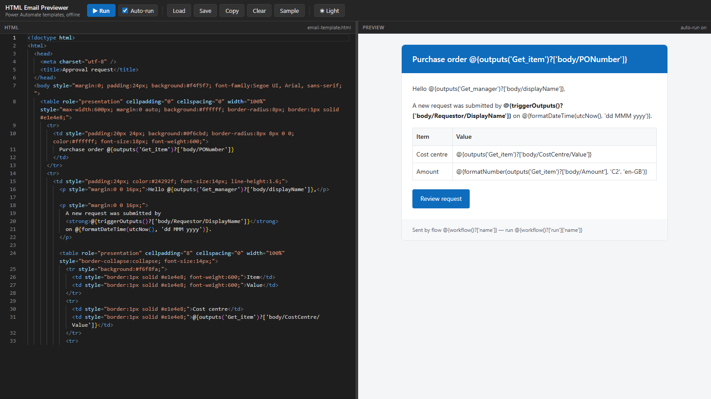

# HTML Email Previewer

A local, offline split-screen editor for the HTML email templates used in
Microsoft Power Automate "Send an email (V2)" actions. Type or paste a template
on the left, see it rendered on the right — no online try-it editors, no upload,
no backend.

Power Automate expressions such as `@{outputs('Get_item')?['body/Title']}` stay
visible as literal text while the surrounding HTML renders normally, so you can
check layout without first stripping the placeholders out.

A second tab, **Document Builder**, converts a Word `.docx` file into clean,
conservative HTML — entirely in the browser — as a starting point for Power
Automate emails and HTML-to-PDF document generation. You can then click into
the preview to insert `{{FieldName}}` template fields.

**Live app:** <https://roryot-ux.github.io/html-email-previewer/>



## Requirements

| Tool | Verified with |
| --- | --- |
| Node.js | v24.21.0 |
| npm | 11.19.0 |
| Git | 2.55.0.windows.2 |

Node 20.19+ or 22.12+ is the practical floor, since that is what Vite 7 supports.

## Local development

```bash
npm install     # pulls React, Vite, Monaco and Mammoth into node_modules
npm run dev     # http://localhost:5173
```

If you already had the project installed before Document Builder was added, run
`npm install` again to pick up the new `mammoth` dependency.

## Production build and preview

```bash
npm run build      # type-check, then emit a production bundle to dist/
npm run preview    # serve the built bundle at http://localhost:4173/
npm run typecheck  # types only, no output
```

Local builds use the root base path `/`, so both `npm run dev` and
`npm run preview` serve the app at the root URL.

To reproduce the GitHub Pages build locally, which uses the base path
`/html-email-previewer/` (see `vite.config.ts`):

```bash
npm run build -- --mode github-pages
```

That bundle only works when served from the `/html-email-previewer/` sub-path,
so `npm run preview` will show a blank page for it; run a normal
`npm run build` again before previewing.

## Deployment (GitHub Pages)

The app is published at <https://roryot-ux.github.io/html-email-previewer/>
by the GitHub Actions workflow in `.github/workflows/deploy.yml`, using the
official GitHub Pages actions (`actions/upload-pages-artifact` and
`actions/deploy-pages`). There is no deploy script and no `gh-pages` branch.

- Every push to `main` runs `npm ci` and
  `npm run build -- --mode github-pages`, then publishes `dist/` to GitHub
  Pages.
- To deploy manually, open the repository's **Actions** tab, select
  **Deploy to GitHub Pages** and click **Run workflow**.
- One-time setup: in the repository's **Settings → Pages**, set
  **Build and deployment → Source** to **GitHub Actions**.

## Using it

The toolbar has two tabs: **Email Editor** (described here) and
**Document Builder** (see [below](#document-builder)).

| Control | What it does |
| --- | --- |
| **Run** | Renders the current editor contents. A dot on the button means the editor has unrendered changes. Shortcut: `Ctrl+Enter`. |
| **Auto-run** | Re-renders automatically ~400 ms after you stop typing. |
| **Load** | Opens an `.html` / `.htm` file from disk into the editor. |
| **Save** | Writes the editor contents to disk (a native save dialog where the browser supports the File System Access API, otherwise a download). Shortcut: `Ctrl+S`. |
| **Copy** | Copies the raw HTML to the clipboard, ready to paste into the Power Automate action. |
| **Clear** | Empties the editor. Undoable with `Ctrl+Z` in the editor. |
| **Sample** | Loads the bundled example approval-email template. |
| **Light / Dark** | Switches the app chrome and the editor theme. The preview always renders on the template's own background, as an email client would. |

Drag the divider between the panels to resize them; double-click it to snap back
to 50/50. The divider is also focusable — `←` / `→` nudge it, `Home` / `End`
jump to the extremes.

The editor contents, auto-run state, theme and split position are kept in
`localStorage`, so a reload brings you back where you left off.

## Document Builder

1. Click the **Document Builder** tab in the toolbar.
2. Click **Upload .docx** and pick a Word document.
3. The generated HTML appears on the left and the rendered document on the
   right. Any conversion warnings are listed above them.
4. Use **Copy HTML** to paste the markup into a Power Automate action, or
   **Download HTML** to save it as an `.html` file.

To tweak the result, paste it into the Email Editor tab and edit it there.

### Template fields

Fields turn a converted document into a reusable template. They are stored in
the HTML as plain `{{FieldName}}` text. That keeps them platform-neutral: the
app does nothing else with them, and whatever fills the template in later only
needs to find and replace that text.

1. **Choose a location** by clicking in the document preview:
   - an empty table cell, empty paragraph, empty list item or empty heading
     (they get a light hover highlight), or
   - a position inside existing text, e.g. just after `Dear `.

   The spot shows as a dashed outline and/or a blue caret, and the toolbar row
   says where the field will go.
2. **Insert Field** asks for a name — letters, numbers, `_`, `.` and `-`, not
   starting with a number. Typing `ApplicantName` (or `{{ApplicantName}}`)
   inserts `{{ApplicantName}}`.
3. The field is highlighted in yellow in the preview, and the generated HTML,
   **Copy HTML** and **Download HTML** update immediately.

The **Fields** panel on the right lists every field in document order, with a
count when a field appears more than once:

| Action | What it does |
| --- | --- |
| Click a name | Selects that field and scrolls both the preview and the generated HTML to it. Click again to move both to the next occurrence; the count changes to e.g. `2 of 3`. |
| **Rename** | Renames every occurrence. Renaming to a name that already exists merges the two. |
| **Remove** | Deletes every occurrence (after a confirmation), leaving those places empty. |

### Finding fields in large documents

The Fields panel, preview and generated HTML share one selection, so you can
start from any of them:

- **Fields panel** — click a name, as above.
- **Preview** — click a field to select it in the panel and scroll the HTML to
  the matching `{{FieldName}}`.
- **Generated HTML** — every `{{FieldName}}` is highlighted and clickable.
  Clicking one selects it in the panel and scrolls the preview to it.

Colours: yellow marks every field. Light blue marks the other occurrences of
the selected field, and solid blue marks the selected occurrence itself.
Occurrences are numbered in document order, so occurrence 2 in the preview is
occurrence 2 in the HTML. Clicking anywhere else in the preview clears the
selection.

The generated HTML pane is read-only text. Select text in it with the mouse, or
use **Copy HTML** to copy all of it.

`{{FieldName}}` text already typed into the Word document is detected as a
field when the document is converted.

Fields are edited in the live preview, so uploading another document starts
again from scratch. Download the HTML first if you want to keep your work.

The file is read and converted in the browser by
[Mammoth](https://github.com/mwilliamson/mammoth.js); it is never uploaded.
The output is a complete HTML document built to survive Outlook and
Power Automate's HTML-to-PDF conversion: a single centred table wrapper
(680 px), plain headings, paragraphs, lists and tables, and inline `style`
attributes — no `<style>` block, CSS Grid or Flexbox.

### Conversion limitations

- **Structure, not appearance.** Headings, paragraphs, bold, italic, lists,
  tables and links are kept. Fonts, colours, font sizes, alignment, spacing,
  page margins, and cell shading or borders from Word are not — the output uses
  its own neutral styling.
- **Headings depend on Word styles.** Only paragraphs using Word's built-in
  *Heading 1–6*, *Title* and *Subtitle* styles become headings. Text that is
  merely made large and bold stays a paragraph. Custom styles are listed in the
  warnings panel and converted as plain paragraphs.
- **Not converted:** headers and footers, text boxes, shapes, SmartArt, charts,
  columns, page breaks, tracked changes and comments. Footnotes and endnotes
  appear as a list at the end.
- **Images** are embedded as base64 data URIs. They work in HTML-to-PDF, but
  many email clients, including Outlook, block them — host the images and
  replace the `src` before using the HTML in an email. The warnings panel flags
  this when images are present.
- **Tables** keep merged cells but lose Word's column widths; every table is
  set to full width with a light grid.
- **`.docx` only.** Older `.doc` files must be re-saved as `.docx` in Word first.
- **Pre-typed fields must be in one formatting run.** If `{{Name}}` in the Word
  document is partly bold, or Word has split it internally (common after
  editing), it is not detected as a field. Remove it and insert it again from
  the preview.
- **Fields cannot go between paragraphs.** Put them inside an existing or empty
  paragraph, list item, heading or table cell. To add a field on its own line,
  add an empty paragraph in Word first.

## How Power Automate expressions survive

The preview is an `<iframe>` whose `srcDoc` receives the editor text completely
untransformed — no templating engine, no string interpolation, no sanitising
pass. To an HTML parser, `@{outputs('Get_item')?['body/Title']}` is ordinary
character data, so it renders as-is in text nodes and is preserved verbatim in
attribute values. Nothing in the app treats `@{`, `{` or `}` as special.

### Known limitations

- **Expressions inside `<style>` blocks or `style="..."` attributes.** This is a
  CSS parsing matter rather than something the previewer controls: a browser's
  CSS parser cannot make sense of `@{...}` in a declaration, so it discards the
  declaration (or the enclosing rule) as invalid. The expression still shows up
  untouched in the HTML you copy out, and Power Automate will substitute it at
  run time — but the preview will not reflect whatever style it produces. Keep
  expressions out of CSS if you want a faithful preview.
- **No JavaScript in the preview.** The iframe sandbox deliberately omits
  `allow-scripts`, matching email clients, which strip scripts anyway.
- **This is not an email-client compatibility checker.** It shows you what
  Chromium makes of your markup. Outlook's Word-based rendering engine is
  stricter; treat the preview as a layout sanity check, not a guarantee.

## Offline by construction

- Word documents are converted in the browser; Mammoth is bundled like
  everything else.
- No CDN: Monaco is imported from `node_modules`, bundled by Vite, and its web
  workers are produced as local assets. The codicon font is emitted into
  `dist/assets` too.
- No backend and no network calls: loading and saving go through browser file
  APIs, and there is nothing to talk to.
- No telemetry.

Monaco's imports in `src/monaco/setup.ts` are deliberately selective: the JSON
and TypeScript language services that the default `monaco-editor` entry point
pulls in are omitted, which keeps roughly 6.5 MB of unused worker code out of
the build.

## Project layout

```
index.html                 Vite entry document
src/main.tsx               React bootstrap
src/App.tsx                State, keyboard shortcuts, wiring
src/styles.css             Theme variables and layout
src/sampleTemplate.ts      Bundled example template
src/types.ts               Shared types
src/components/
  CodeEditor.tsx           Monaco wrapper (undo-preserving external updates)
  DocumentBuilder.tsx      Document Builder tab (.docx upload, output, warnings, fields)
  Preview.tsx              Sandboxed iframe preview
  SplitPane.tsx            Draggable / keyboard-resizable divider
  Toolbar.tsx              Tabs, buttons and toggles
src/hooks/
  usePersistentState.ts    useState backed by localStorage
src/lib/
  docxConvert.ts           .docx → conservative HTML (Mammoth + inline styles)
  fieldEditing.ts          {{Field}} insert / rename / remove / highlight in the preview
  mammoth-browser.d.ts     Types for Mammoth's browser bundle
  fileIo.ts                Load, save and clipboard helpers
src/monaco/
  setup.ts                 Local Monaco + worker registration
  monaco-esm.d.ts          Declaration for the untyped edcore.main entry
```

## Licence

Private project, no licence granted.
